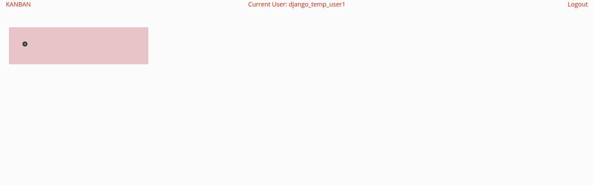
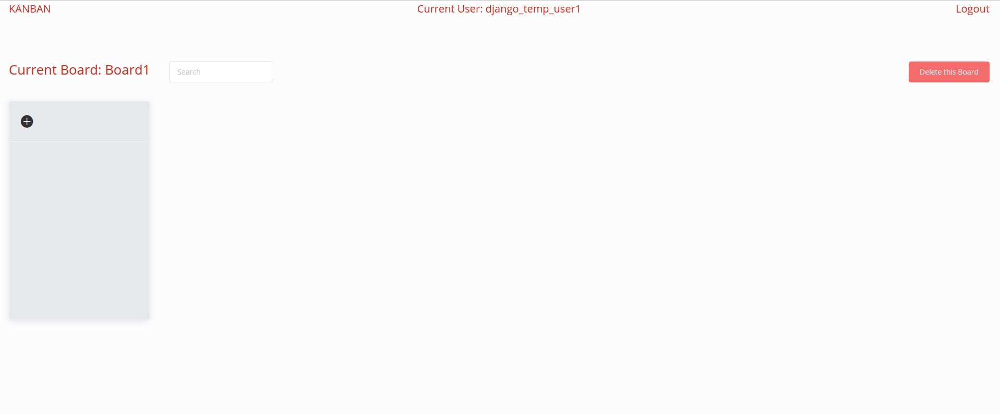
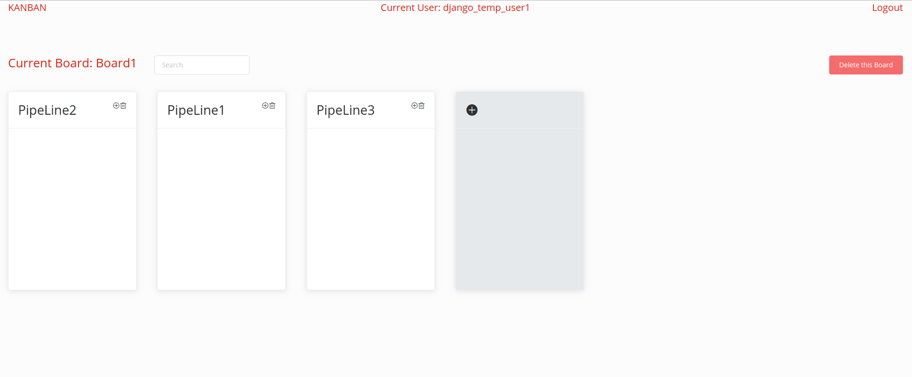

# DjangoVueKanBan
---
前端： 
```
ES2015
vue
vue-cli
vuex
vue-router
vue-native-websocket
vuedraggable
axios
lodash
element-ui
bootstrap
```

后端：
```
pipenv
Django
Django Rest Framework
Django channels(websocket)
channels-redis(channels backend)
sqlite
```


# Screenshot
----------


#### Signup and Login


#### Board(get data from API)



#### PipeLine(get data from websocket)



#### Card(get data from API)




# How to start
```
light up redis(the simplest way: in terminal, type 'redis-server'. )

frontend:
cd frontend/vue/ npm install
npm run build-watch

backend:
pipenv install
pipenv shell
python manage migrate
python manage runserver 
```